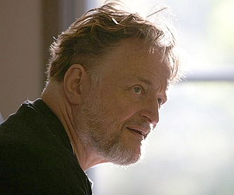

# John Conway's Game of Life in React mini-project

## :bulb: Idea and purpose for this project :bulb:

I wanted to learn a bit of [React](https://en.wikipedia.org/wiki/React_(JavaScript_library)) technology so I started thinking about some kind of mini-project where I'm able to get into basic principles of React.js.

I remember that during my studies I was really into *cellura automata* and I was really impressed with so simple but yet so complex idea of zero-player *game*.

I already knew I wanted to create simple implementation of the basic Conway's Game of Life's rules into working project. I had a little help from React's documentation, youtube tutorials and other projects similar to this one.

In the end I've also used some Sass (SCSS) to beautify entire project. As you can see it covers some of the pure JavaScript aspects as well as React.js library.

*This React project was bootstrapped with [Create React App](https://github.com/facebook/create-react-app).* :sweat_smile:

I've also tried to make clean code using JSDoc comments.

## :godmode: John H. Conway - author of the Game of Life's idea :godmode:

**[John Horton Conway]((https://en.wikipedia.org/wiki/John_Horton_Conway))** FRS (26 December 1937 – 11 April 2020) was an English mathematician active in the theory of finite groups, knot theory, number theory, combinatorial game theory and coding theory. He also made contributions to many branches of recreational mathematics, most notably the invention of the cellular automaton called the Game of Life. (via [Wikipedia](https://en.wikipedia.org/wiki/John_Horton_Conway))

## :game_die: "The Game of Life" :game_die:

")
*- Heavy-weight spaceship (HWSS)*

"[The Game of Life](https://en.wikipedia.org/wiki/Conway%27s_Game_of_Life), also known simply as *Life*, is a cellular automaton devised by the British mathematician John Horton Conway in 1970. It is a zero-player game, meaning that its evolution is determined by its initial state, requiring no further input. One interacts with the Game of Life by creating an initial configuration and observing how it evolves. It is Turing complete and can simulate a universal constructor or any other Turing machine."

### :memo: Rules (basic) of the Game of Life :memo:

1. Any live cell with two or three live neighbours survives.
2. Any dead cell with three live neighbours becomes a live cell.
3. All other live cells die in the next generation. Similarly, all other dead cells stay dead.

